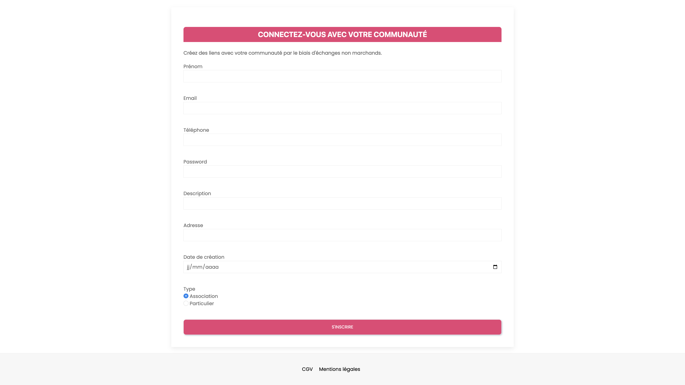
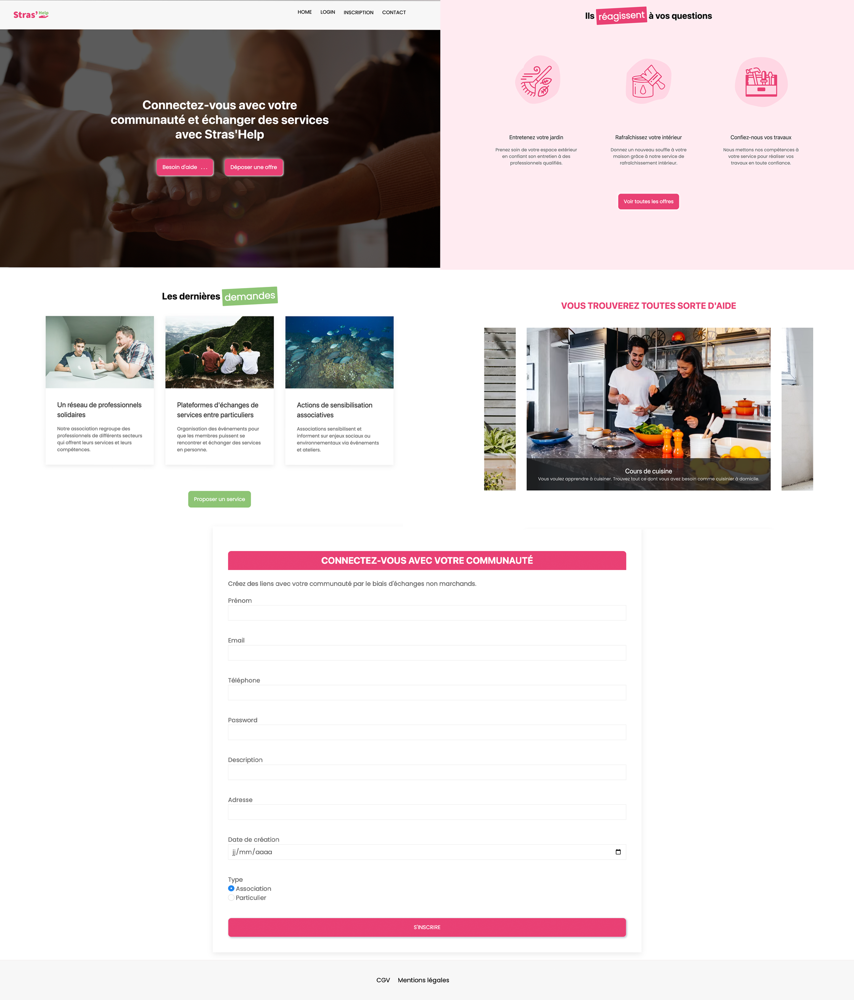
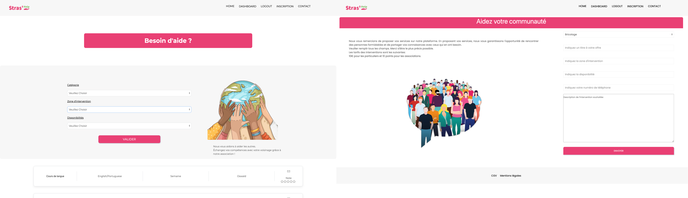

# Projet de l'association Stras'Help

Stras'Help est site internet d'une association dédiée à faciliter l'échange de services et à favoriser les connexions entre différentes associations et particuliers. Notre mission etaient de promouvoir la collaboration et l'entraide au sein de la communauté en mettant en relation des organisations et des individus qui sont prêts à offrir leurs services et ceux qui en ont besoin.

## Développement du Site

### Collaboration de 4 personnes | Durée de création : 5 semaines

Dans le cadre de ce projet, une équipe de 4 personnes passionnées s'est réunie pour créer une plateforme d'échange de services. Chaque membre de l'équipe avait un rôle spécifique défini afin de maximiser l'efficacité de notre collaboration.

Nous avons travaillé en étroite collaboration pendant une période de 5 semaines, en mettant en application nos connaissances techniques acquises dans les domaines du PHP, du CSS et de Twig pour développer une plateforme d'échange de services fonctionnelle, conviviale et attrayante.

### Objectif du site

Notre objectif principal était de fournir une solution pratique et efficace pour connecter les associations et les particuliers afin de favoriser l'entraide et la collaboration au sein de la communauté.

### Critères obligatoires

- Site 100% Responsive.
- Utilisation de Framework et l'utilisation d'un Backlog pour gérer l'avancer du travail.
- Avoir un formulaire d'inscription pour une association et pour les particuliers.
- Formulaire de contact.
- Pouvoir déposer et rechercher une offre.
- Un dashboard spécialement pour le président de l'association pour rajouter ou supprimer des offres et services. 
- Création d'une base de données.


### Travail personnel

Pour ce projet j'ai réalisé la page d'accueil en totalité avec le pied de page, sauf la barre de navigation, avec l'utilisation des effets de transition / apparition des boutons sur le header, ainsi des transitions sur les cartes ainsi la mise en place d'un carrousel de photos libres de droits.

- Réalisation du logo et de la charte graphique ainsi le favicon.

- Création du formulaire d'inscription avec la réalisation du CRUD adéquate en PHP en simple MVC.

Le travail personnel en images:

Le logo du site: 


Le formulaire d'inscription à la page d'accueil: 



## Accomplissement collaboratif de l'équipe

Grâce à notre collaboration collective fructueuse, nous avons pu concrétiser les fonctionnalités suivantes :

- Implémentation d'un système de connexion et de déconnexion.
- Utilisation de PHPMailer pour l'envoi de mails.
- Affichage de toutes les offres du site avec des options de filtrage.
- Développement d'un compte administrateur pour le président de l'association, lui permettant d'accéder à toutes les offres et fonctionnalités.
- Création de fenêtres contextuelles (pop-up) pour la connexion et l'envoi de mails.

## Technologies Employées

- HTML/CSS
- Javascript
- PHP
- TWIG
- MySQL
- Git/GitHub

### Quelques images du projet

- La page d'accueil:



- La page déposer mes offres et besoin d'aide:



## Les étapes pour visualiser le projet

Pour la visualisation du projet il faut suivre les étapes suivantes:

1. Clonez le repository depuis Github.
2. Exécutez la commande `composer install` sur votre terminal.
3. Créez _config/db.php_ à partir du fichier _config/db.php.dist_ et ajoutez les paramètres de votre base de données. Ne supprimez pas le fichier _.dist_, il doit être conservé.

```php
define('APP_DB_HOST', 'your_db_host');
define('APP_DB_NAME', 'your_db_name');
define('APP_DB_USER', 'your_db_user_wich_is_not_root');
define('APP_DB_PASSWORD', 'your_db_password');
```

4. Importez _database.sql_ dans votre serveur SQL, vous pouvez le faire manuellement ou utiliser le script _migration.php_ qui importera un fichier _database.sql_.
5. Lancez le serveur web PHP interne avec `php -S localhost:8000 -t public/`. L'option `-t` avec `public` comme paramètre signifie que votre hôte local ciblera le dossier `/public`.
6. Allez sur `localhost:8000` avec votre navigateur préféré.
7. À partir de ce kit de démarrage, créez votre propre application web.

### Utilisateurs Windows

Si vous développez sous Windows, vous devez éditer votre configuration git pour changer vos règles de fin de ligne avec cette commande :

`git config --global core.autocrlf true`

## Me contacter

Pour plus de renseignements contactez-moi sur [LinkedIn](https://www.linkedin.com/in/fouadtebi/), je suis plus réctif.

**Merci**.
